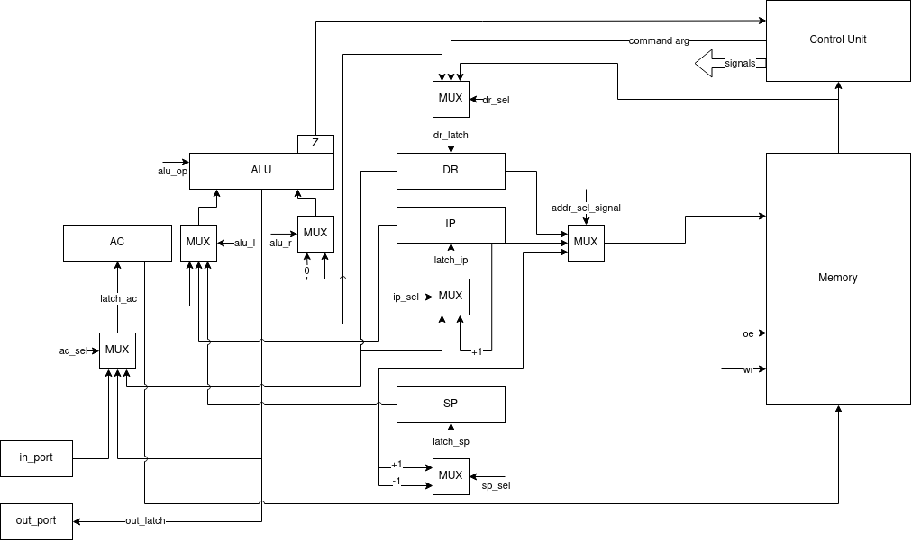
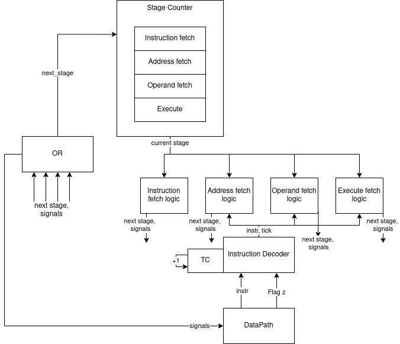

# Отчёт по лабораторной работе № 3

Выполнил Русинов Дмитрий Станиславович P33302

Вариант
```lisp | acc | neum | hw | tick | struct | stream | port | pstr | prob1 | 8bit```

Без усложнения

## Язык программирования

Язык lisp-подобный.

Любое выражение в скобках (s-expression) возвращает значение.
Поддерживаются числовые и строковые литералы.
Типизация динамическая, поддерживаются два типа: целые числа и строки. Причем
функции `get_char`, `print_char` работают именно с целыми числами.

```bnf
program = s_expression

s_expression = "(" atom ")" | expression | "("s_expression")"
   
atomic_symbol = identifier | string_literal | number

expression = defun_expr 
    | if_expr 
    | while_expr 
    | setq_exp
    | print_char_exp
    | print_string_exp
    | user_defined_function_call_exp
    | progn_exp
    | import_expr
    
defun_expr = "(" "defun" identifier "(" identifiers ")" s_expression ")"

identifiers = identifier | identifier identifiers

if_expr = "(" "if" s_expression s_expression s_expression ")"

while_expr = "(" "while" s_expression s_expression ")"

setq_exp = "(" "setq" identifier s_expression ")"

print_char_exp = "(" "print_char" s_expression ")"

print_string_exp = "(" "print_string" s_expression ")"

user_defined_function_call_exp = "(" identifier s_expressions ")"

progn_exp = "(" "progn" s_expressions ")"

s_expressions = s_expression | s_expression s_expressions

identifier = idenitfier_symbol | identifier_symbol identifier

idenitfier_symbol = letter | "_"

string_literal = "\"" *any symbol* "\""
```

* `defun` - определение функции, возвращает 0. Рекурсивные функции не поддерживаются, так как не требовались.
* `if` - условный оператор, возвращает значение второго выражения, если первое не равно 0, иначе третье.
Обязательно должно быть три выражения - условие, ветка иначе, ветка истины.
* `while` - цикл с предусловием, возвращает результат последнего выражения в теле цикла в последней итерации.
* `setq` - присваивание, возвращает значение присвоенной переменной.
* `print_char` - выводит символ с кодом, равным значению выражения, возвращает код символа.
* `print_string` - выводит строку, равную значению выражения, возвращает выведенную строку.
* `progn` - последовательное выполнение выражений, возвращает результат последнего выражения.
* вызов функции - возвращает результат функции (последнего выражения в теле функции).
* литералы - возвращают сами себя.
* идентификаторы - возвращают значение переменной, к которой они привязаны.
Использование идентификатора функции без ее вызова недопустимо.

## Организация памяти 

Фон Неймановская архитектура.

Память представляет из себя три секции:

```angular2html
    +-----------------+
    |   JMP_TO_CODE   |
    +-----------------+
    |   STATIC_DATA   |
    |                 |
    |                 |
    |                 |
    +-----------------+
    |      CODE       |
    |                 |
    |                 |
    |                 |
    +-----------------+
    |      STACK      |
    |                 |
    |                 |
    +-----------------+
```

* `JMP_TO_CODE` - единственная инструкция, которая по своей сути является адресной командой
JMP, которая переходит на начало секции `CODE`.

* `STATIC_DATA` - секция, в которой хранятся строки (строковые литералы, а также строки, введенные пользователем)
Строки расположены в том порядке, в котором они встречаются в AST программы (в этом контексте объявление буффера для
ввода пользователя - тоже строка)

* `CODE` - секция, в которой хранятся инструкции.

После вычисления любого выражения, его результат кладется в аккумулятор.
При вычислении выражения с бинарным оператором, второй операнд вычисляется, кладется на стек,
после чего вычисляется перывый и проводится операция над ними с помощью адресации относительно стека.

Функции хранятся в секции `CODE` в виде списка инструкций, которые выполняются последовательно. Перед
телом функции идет инструкция `JMP`, которая позоляет перепрыгнуть через ее тело.

Все переменные аллоцируются на стеке. Если при этом переменная была объявлена внутри функции,
область ее видимости ограничивается телом функции.

Числовые литералы загружаются с помощью непосредственной адресации, считается, что они всегда помещаются в
машинное слово.

Так как у процессора аккумуляторная архитектура, то в аккумуляторе всегда хранится лишь результат последнего
вычисленного выражения, дополнительных регистров для хранения исключительно переменных нет.

## Система команд

* Машинное слово - 64 бита, знаковое.
* Так как архитектура аккумуляторная, все команды имеют всего один аргумент (или ни одного), а регистр
общего назначения всего один.
* Ввод-вывод осущетсвляется как поток токенов, port-mapped.
* Поток управления:
  * Поддерживаются условные и безусловные переходы.
  * В случае, если инструкция не касается переходов, то после нее инкрементится IP (Instruction Pointer).

Поддерживаются 4 вида адресации:
* Непосредственная
* Относительно стека
* Косвенная (относительно значения по переданному адресу)
* Адресная

Также команда может быть безадресной.

На выполнение каждой инструкции есть 4 цикла:
1. Цикл выборки инструкции.
2. Цикл выборки адреса (для адресации относительно стека и косвенной).
3. Цикл выборки операнда (для всех видов адресации, кроме непосредственной).
4. Цикл исполнения.

### Набор инструкций

| Инструкция | ард/безадр | Количество тактов в цикле исполнения | Описание                                                             |
|------------|------------|--------------------------------------|----------------------------------------------------------------------|
| `LD`       | ард        | 1                                    | AC <- MEM(ARD)                                                       |
| `ST`       | ард        | 1                                    | MEM(ARD) <- AC                                                       |
| `ADD`      | ард        | 1                                    | AC <- AC + MEM(ARD)                                                  |
| `SUB`      | ард        | 1                                    | AC <- AC - MEM(ARD)                                                  |
| `MUL`      | ард        | 1                                    | AC <- AC * MEM(ARD)                                                  |
| `DIV`      | ард        | 1                                    | AC <- AC / MEM(ARD)                                                  |
| `MOD`      | ард        | 1                                    | AC <- AC % MEM(ARD)                                                  |
| `EQ`       | ард        | 1                                    | if AC == MEM(ARD) then AC <- 1 else AC <- 0                          |
| `GT`       | ард        | 1                                    | if AC > MEM(ARD) then AC <- 1 else AC <- 0                           |
| `LT`       | ард        | 1                                    | if AC < MEM(ARD) then AC <- 1 else AC <- 0                           |
| `JZ`       | ард        | 1                                    | if AC == 0 then IP <- ARD                                            |
| `JNZ`      | ард        | 1                                    | if AC != 0 then IP <- ARD                                            |
| `JMP`      | ард        | 1                                    | IP <- ARD                                                            |
| `PUSH`     | безадр     | 2                                    | SP <- SP - 1; MEM(SP) <- AC                                          |
| `POP`      | безадр     | 1                                    | SP <- SP + 1                                          |
 | `IN`       | безадр     | 1                                    | AC <- next_token                                                     |
| `OUT`      | безадр     | 1                                    | print AC                                                             |
| `CALL`     | ард        | 3                                    | SP <- SP - 1; MEM(SP) <- IP; IP <- ARD                               |
| `RET`      | безадр     | 2                                    | IP <- MEM(SP); SP <- SP + 1                                          |
| `HLT`      | безадр     | 1                                    | завершение работы программы                                          |

## Траслятор
Транслятор состоит из двух частей:
* Лексер, реализован в [tokenizer](./computer_simulator/translator/tokenizer.py)
* Модуль, преобразующий токены в программу, реализован в [expression_translator](./computer_simulator/translator/expression_translator.py)

На вход принимает два файла:
* Файл с программой на языке высокого уровня.
* Путь к файлу, в который будет записана программа в машинных словах (в виде JSON)

## Модель процессора
Модель процессора реализована в [machine](./computer_simulator/machine)

### DataPath



Реализован в классе `DataPath`

Элементы:
* `Z` - Флаг zero
* `DR` - Data Register
* `IP` - Instruction Pointer
* `SP` - Stack Pointer
* `AC` - Accumulator
* `ALU` - Arithmetic Logic Unit

### ControlUnit
Реализован в классе `ControlUnit`



Основная работа с данными происходит на уровне DataPath, а ControlUnit с помощью
сигналов работает с этими данными. ControlUnit реализован как hardwired.

## Тестирование

Для CI использовался пайплайн из примера, но модифицированный под гитхаб:
```yaml
name: Python CI

on:
  push:
    branches:
      - master

jobs:
  computer-simulator:
    runs-on: ubuntu-latest

    steps:
    - name: Checkout code
      uses: actions/checkout@v2

    - name: Set up Python
      uses: actions/setup-python@v3
      with:
        python-version: 3.12

    - name: Install dependencies
      run: |
        python -m pip install --upgrade pip
        pip install poetry
        poetry install

    - name: Run tests and coverage
      run: |
        poetry run pytest --verbose
        poetry run coverage run -m pytest
        poetry run coverage report

    - name: Run mypy checks
      run: poetry run mypy .

    - name: Check code formatting
      run: poetry run ruff format --check .

    - name: Run code linting
      run: |
        poetry run ruff check .
```

Реализованы unit тесты для лексера ([test_tokenizer](./test/test_tokenizer.py))
Также реализованы golden тесты согласно примеру ([test_golden](./test/test_golden.py)):
* ([hello](./golden/hello.yml))
* ([cat](./golden/cat.yml)
* ([hello_user_name](./golden/hello_user.yml))
* ([prob1](./golden/prob1_very_small.yml))

Также реализованы некоторые дополнительные алгоритмы:
* ([every_statement_is_expression](./golden/every_statement_is_expression.yml))
* ([if_demo](./golden/if_demo.yml))
* ([many_variables](./golden/many_variables.yml))

### Подробный разбор одной из программ
Возьмем программу (cat):

```common lisp
  (progn 
    (read_char a)
    (while (> a 0)
      (progn
        (print_char a)
        (read_char a))))
```

После трансляции она будет выглядеть вот так:
```json
{
  "memory": [
    {
      "opcode": "JMP",
      "address": 0,
      "arg": {
        "value": 512,
        "type": "ADDRESS"
      },
      "comment": "Skip static memory"
    },
    {
      "opcode": "PUSH",
      "address": 512,
      "comment": "Push var a"
    },
    {
      "opcode": "IN",
      "address": 513
    },
    {
      "opcode": "ST",
      "address": 514,
      "arg": {
        "value": 0,
        "type": "STACK_OFFSET"
      }
    },
    {
      "opcode": "LD",
      "address": 515,
      "arg": {
        "value": 0,
        "type": "DIRECT"
      }
    },
    {
      "opcode": "PUSH",
      "address": 516,
      "comment": "Push var #binop result"
    },
    {
      "opcode": "LD",
      "address": 517,
      "arg": {
        "value": 1,
        "type": "STACK_OFFSET"
      }
    },
    {
      "opcode": "GT",
      "address": 518,
      "arg": {
        "value": 0,
        "type": "STACK_OFFSET"
      }
    },
    {
      "opcode": "POP",
      "address": 519
    },
    {
      "opcode": "JZ",
      "address": 520,
      "arg": {
        "value": 526,
        "type": "ADDRESS"
      }
    },
    {
      "opcode": "LD",
      "address": 521,
      "arg": {
        "value": 0,
        "type": "STACK_OFFSET"
      }
    },
    {
      "opcode": "OUT",
      "address": 522
    },
    {
      "opcode": "IN",
      "address": 523
    },
    {
      "opcode": "ST",
      "address": 524,
      "arg": {
        "value": 0,
        "type": "STACK_OFFSET"
      }
    },
    {
      "opcode": "JMP",
      "address": 525,
      "arg": {
        "value": 515,
        "type": "ADDRESS"
      }
    },
    {
      "opcode": "HLT",
      "address": 526
    }
  ]
}
```

В начале происходит пропуск статической памяти, иницилизируется перменная `a` посредством пуша ее на стек.
Далее она считывается впервые и начинается цикл.
В начале цикла мы делаем `JNZ` на случай, если из ввода нам пришел `0`, что будет означать, что в буффере не осталось
символов.
Далее с помощью вызовов `OUT` и `IN` мы выводим пришедший нам символ и считываем его снова.
В конце тела цикла мы делаем `JMP` в его начало, чтобы вновь свериться с условием продолжения.

## Аналитика

```text
| Русинов Дмитрий Станиславович | hello | 3         | -             | 41            | 96       | 368     | lisp | acc | neum | hw | tick | struct | stream | port | pstr | prob1 | 8bit |
| Русинов Дмитрий Станиславович | cat   | 6         | -             | 16            | 44       | 163     | lisp | acc | neum | hw | tick | struct | stream | port | pstr | prob1 | 8bit |
| Русинов Дмитрий Станиславович | prob1 | 12        | -             | 164           | 39251    | 151928  | lisp | acc | neum | hw | tick | struct | stream | port | pstr | prob1 | 8bit |
```

